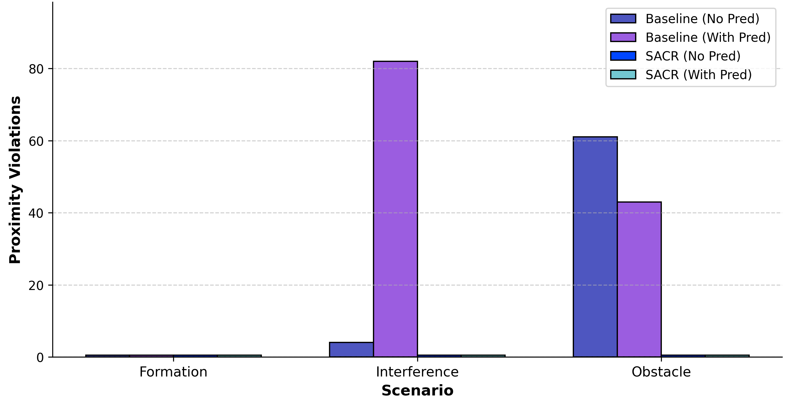
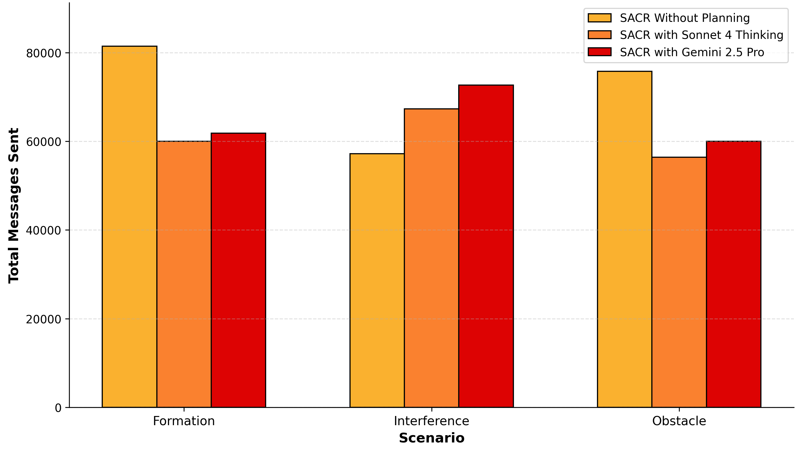
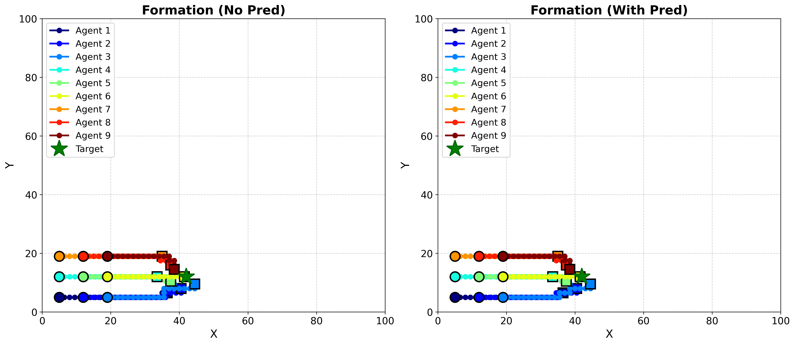
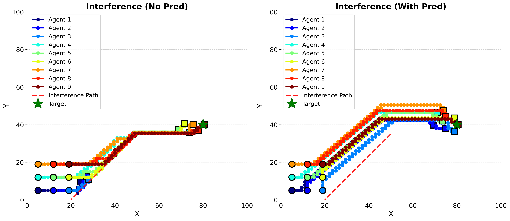
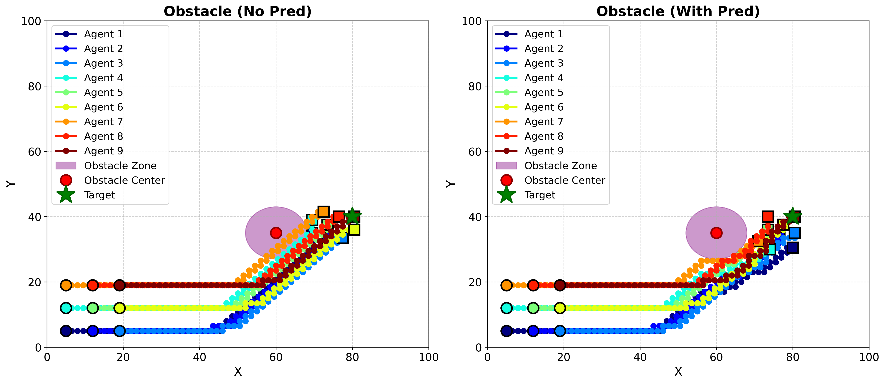

# Multi-Agent Path Planning with SACR Protocol and LLM Planning

Comparative study of multi-agent coordination: Baseline vs SACR protocol vs LLM-enhanced SACR (Claude Sonnet 4 Thinking & Gemini 2.5 Pro).

## 🎯 Overview

Three approaches to multi-agent path planning:

1. **Baseline** - No inter-agent communication
2. **SACR Protocol** - Signal, Acknowledge, Communicate, Resolve communication protocol
3. **LLM-Enhanced SACR** - SACR + strategic planning (Sonnet 4 / Gemini 2.5 Pro)

Tested across Formation, Interference, and Obstacle scenarios with/without prediction.

## ✨ Key Features

- Three implementation variants with comprehensive metrics
- Multi-scenario testing (Formation, Interference, Obstacle)
- Prediction toggle for each scenario
- LLM comparison: Claude Sonnet 4 Thinking vs Gemini 2.5 Pro
- Rich visualizations and statistical analysis

## 📊 Results Summary

### Proximity Violations

| Scenario | Baseline (No Pred) | Baseline (With Pred) | SACR (Both) |
|----------|-------------------|---------------------|-------------|
| Formation | 0 | 0 | 0 |
| Interference | 4 | 82 | 0 |
| Obstacle | 61 | 43 | 0 |



**SACR achieved zero violations across all scenarios.**

### Communication Efficiency

| Approach | Formation | Interference | Obstacle |
|----------|-----------|--------------|----------|
| SACR (No Planning) | 40,735 | 28,601 | 37,890 |
| SACR + Sonnet 4 | 29,997 | 33,660 | 28,219 |
| SACR + Gemini 2.5 Pro | 30,907 | 36,325 | 29,990 |



**LLM planning reduces messages by 24-35% in Formation/Obstacle scenarios.**

### Plan Adherence Rates

| LLM | Formation | Interference | Obstacle |
|-----|-----------|--------------|----------|
| Sonnet 4 | 93.5% | 89.1-98.1% | 100% |
| Gemini 2.5 Pro | 85.0-85.8% | 80.9-81.2% | 86.2% |

**Sonnet 4 shows superior adherence (89-100%) vs Gemini (81-86%).**

### Visualizations





## 📁 Repository Structure

```
multi-agent-sacr-simulation/
├── README.md
├── src/
│   ├── baseline.py              # Baseline (no communication)
│   ├── sacr.py                  # SACR protocol
│   └── llm_planning_sacr.py     # LLM-enhanced SACR
├── results/
│   ├── sonnet/                  # Sonnet 4 results (S-*.json)
│   └── gemini/                  # Gemini 2.5 Pro results (G-*.json)
└── figures/                     # Visualizations (PNG)
```

## 🚀 Installation

```bash
git clone https://github.com/mostafamehrabii/multi-agent-sacr-simulation.git
cd multi-agent-sacr-simulation
pip install numpy matplotlib
```

## 💻 Usage

```bash
# Run simulations
python src/baseline.py
python src/sacr.py
python src/llm_planning_sacr.py
```

### Key Parameters

```python
N_AGENTS = 9                # Number of agents
RHO = 7.0                   # Formation distance
SAFE_DISTANCE = 10.0        # Minimum safe distance
MAX_STEPS = 400             # Maximum steps
PREDICTION_STEPS = 10       # Prediction horizon
```

## 🔬 Methodology

### SACR Protocol

Six message types for coordination:
- MOVEMENT_INTENT - Broadcast trajectories
- PROXIMITY_WARNING - Alert conflicts
- YIELD_REQUEST - Negotiate right-of-way
- YIELD_ACKNOWLEDGE - Confirm yield
- CLEAR_SIGNAL - Path clear
- EMERGENCY_STOP - Immediate halt

### Safety Zones
- Collision: 2.0 units
- Warning: 4.0 units
- Communication: 15.0 units

### LLM Integration
LLMs generate strategic plans based on positions, targets, and obstacles. SACR handles real-time collision avoidance during execution.

## 🎮 Scenarios

1. **Formation** - Maintain cohesive formation to target
2. **Interference** - Navigate through adversarial interference
3. **Obstacle** - Navigate around obstacles

Each tested with/without 10-step prediction.

## 📈 Metrics

- **Safety**: Proximity violations, collisions
- **Efficiency**: Message count
- **Planning**: Adherence rate

## 🔧 Technical Details

- Platform: Kaggle (CPU)
- Grid: 100×100 units
- Output: JSON results, 300 DPI PNG figures

## 📚 Citation

```bibtex
@software{multi_agent_sacr_2025,
  title={Multi-Agent Path Planning with SACR Protocol and LLM-Enhanced Planning},
  author={Mostafa Mehrabi},
  year={2025},
  url={https://github.com/mostafamehrabii/multi-agent-sacr-simulation}
}
```

## 📧 Contact

Questions? Open an issue or contact mmehrabi.mostafa@gmail.com

---

⭐ **Star this repo if you find it useful!**
